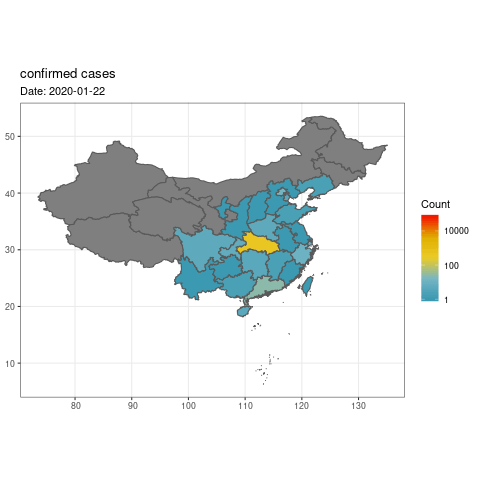
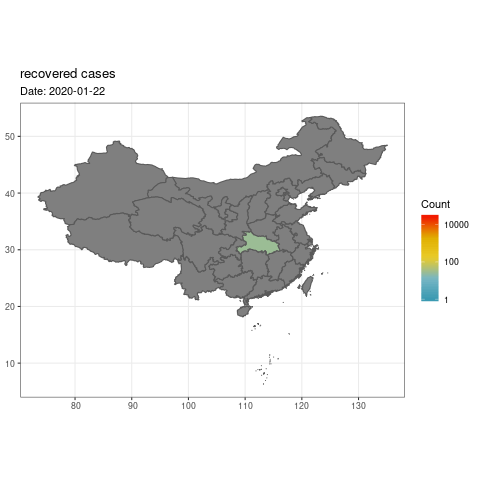
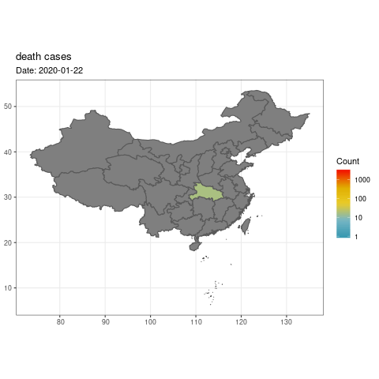
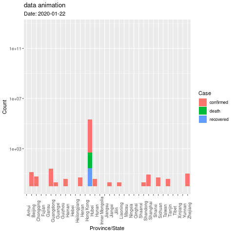

```{r setup, include=FALSE}
knitr::opts_chunk$set(echo = TRUE, cache = TRUE)
```

## Task

1. Develop a Shiny app that visualizes the progression of the 2019-20 Global Coronavirus Outbreak. 

2. If you are ambitious, bring in visualization of other types of data, e.g., stock market, tweets, contrast with previous outbreak (e.g., 2003 SARS, 2009 H1N1, 2012 MERS, 2014 Ebola), prediction from your statistical/epidemiological model, and so on. 

3. Publish your Shiny app to <https://www.shinyapps.io> and share the link.

4. (Optinal) Submit your app to the 2020 Shiny Contest (deadline 20 March 2020 at 5pm ET). 

Below is some data exploration, which may help you get started. You do _not_ have to use it. Note below code may change frequently.

<!-- Johns Hopkins CSSE Visualization: <https://gisanddata.maps.arcgis.com/apps/opsdashboard/index.html#/bda7594740fd40299423467b48e9ecf6> -->

<!-- Downloadable Google sheet: -->
<!-- <https://docs.google.com/spreadsheets/d/1wQVypefm946ch4XDp37uZ-wartW4V7ILdg-qYiDXUHM/edit#gid=787605648> -->

<!-- Time series table: <https://docs.google.com/spreadsheets/d/1UF2pSkFTURko2OvfHWWlFpDFAr1UxCBA4JLwlSP6KFo/edit#gid=0> -->

## Prerequisite
```{r include=FALSE}
library(tidyverse)
library(lubridate)
library(wesanderson)
library(sf)
library(gganimate)
library(transformr)
library(maps)
library(shiny)
fluidPage()
```

## Import JHU SSE data on GitHub into R

Since Feb 11, JHU SSE is hosting 2019 nCoV data on GitHub repo: <https://github.com/CSSEGISandData/2019-nCoV>.

Let's import the time series data directly from the csv file on GitHub:

```{r}
(confirmed <- read_csv("https://raw.githubusercontent.com/CSSEGISandData/COVID-19/master/csse_covid_19_data/csse_covid_19_time_series/time_series_19-covid-Confirmed.csv"))
(recovered <- read_csv("https://raw.githubusercontent.com/CSSEGISandData/COVID-19/master/csse_covid_19_data/csse_covid_19_time_series/time_series_19-covid-Recovered.csv"))
(death <- read_csv("https://raw.githubusercontent.com/CSSEGISandData/COVID-19/master/csse_covid_19_data/csse_covid_19_time_series/time_series_19-covid-Deaths.csv"))
```

## Tidy data

I want to tidy data into the long format. `pivot_longer` is the modern version of `gather` function in dplyr.

```{r}
confirmed_long <- confirmed %>%
  pivot_longer(-(`Province/State`:Long), 
               names_to = "Date", 
               values_to = "confirmed") %>%
  mutate(Date = (mdy(Date))) # convert string to date-time
confirmed_long
```

```{r}
recovered_long <- recovered %>%
  pivot_longer(-(`Province/State`:Long), 
               names_to = "Date", 
               values_to = "recovered") %>%
  mutate(Date = mdy(Date))
recovered_long
```

```{r}
death_long <- death %>%
  pivot_longer(-(`Province/State`:Long), 
               names_to = "Date", 
               values_to = "death") %>%
  mutate(Date = mdy(Date))
death_long
```

```{r}
ncov_tbl <- confirmed_long %>%
  left_join(recovered_long) %>%
  left_join(death_long) %>%
  pivot_longer(confirmed:death, 
               names_to = "Case", 
               values_to = "Count")
ncov_tbl %>% print(width = Inf)
# prepare coronavirus data for shiny app
saveRDS(ncov_tbl, file = "../2019-20Coronavirus/ncov_tbl.rds")
```

## Mapping preparation

### Mapping China provinces

#### Use GIS data from China

A self note about installing `sf` package on CentOS 7: <https://gist.github.com/Hua-Zhou/6c11babe35437ce1ea8e4893a14d07c8>.

Donwload China GIS data from [here](https://uploads.cosx.org/2009/07/chinaprovinceborderdata_tar_gz.zip), unzip, and put in the working directory.

```{bash}
ls -l bou2_4p.*
```

Read in the shape file into simple feature (SF) format. Replace the `NA` in `NAME` by Macau.

```{r}
library(sf)
chn_map <- st_read("./bou2_4p.shp", as_tibble = TRUE) %>%
  mutate(NAME = iconv(NAME, from = "GBK"),
         BOU2_4M_ = as.integer(BOU2_4M_),
         BOU2_4M_ID = as.integer(BOU2_4M_ID)) %>%
  mutate(NAME = str_replace_na(NAME, replacement = "澳门特别行政区")) %>%
  print()
```

There are about 34 provinces in China, why there are 925 areas? Because one province is composed of n (n >= 1) polygons. 

```{r}
chn_map %>% 
  count(NAME) %>% 
  print(n = Inf)
```

`ggplot2` can plot SF data using `geom_sf` function:

```{r}
chn_map %>%
  ggplot() + 
  geom_sf(mapping = aes(geometry = geometry), color = "black", fill = "white") + 
  #geom_sf_label(mapping = aes(label = NAME)) + 
  theme_bw() # better for maps 
```

These are the provinces available from the JHU sheets.

```{r}
ncov_tbl %>%
  filter(`Country/Region` %in% c("Mainland China", "Macau", 
                                 "Hong Kong", "Taiwan")) %>%
  distinct(`Province/State`, `Country/Region`) %>%
  print(n = Inf)
```

In order to join the tibbles `ncov_tbl` and `chn_map`, we need to use the province name as key. Let's create a function to translate Chinese province name to English.

```{r}
translate <- function(x) {
  sapply(x, function(chn_name) {
    if (str_detect(chn_name, "澳门")) {
      eng_name <- "Macau"
    } else if (str_detect(chn_name, "台湾")) {
      eng_name <- "Taiwan"
    } else if (str_detect(chn_name, "上海")) {
      eng_name <- "Shanghai"
    } else if (str_detect(chn_name, "云南")) {
      eng_name <- "Yunnan"
    } else if (str_detect(chn_name, "内蒙古")) {
      eng_name <- "Inner Mongolia"
    } else if (str_detect(chn_name, "北京")) {
      eng_name <- "Beijing"
    } else if (str_detect(chn_name, "台湾")) {
      eng_name <- "Taiwan"
    } else if (str_detect(chn_name, "吉林")) {
      eng_name <- "Jilin"
    } else if (str_detect(chn_name, "四川")) {
      eng_name <- "Sichuan"
    } else if (str_detect(chn_name, "天津")) {
      eng_name <- "Tianjin"
    } else if (str_detect(chn_name, "宁夏")) {
      eng_name <- "Ningxia"
    } else if (str_detect(chn_name, "安徽")) {
      eng_name <- "Anhui"
    } else if (str_detect(chn_name, "山东")) {
      eng_name <- "Shandong"
    } else if (str_detect(chn_name, "山西")) {
      eng_name <- "Shanxi"
    } else if (str_detect(chn_name, "广东")) {
      eng_name <- "Guangdong"
    } else if (str_detect(chn_name, "广西")) {
      eng_name <- "Guangxi"
    } else if (str_detect(chn_name, "新疆")) {
      eng_name <- "Xinjiang"
    } else if (str_detect(chn_name, "江苏")) {
      eng_name <- "Jiangsu"
    } else if (str_detect(chn_name, "江西")) {
      eng_name <- "Jiangxi"
    } else if (str_detect(chn_name, "河北")) {
      eng_name <- "Hebei"
    } else if (str_detect(chn_name, "河南")) {
      eng_name <- "Henan"
    } else if (str_detect(chn_name, "浙江")) {
      eng_name <- "Zhejiang"
    } else if (str_detect(chn_name, "海南")) {
      eng_name <- "Hainan"
    } else if (str_detect(chn_name, "湖北")) {
      eng_name <- "Hubei"
    } else if (str_detect(chn_name, "湖南")) {
      eng_name <- "Hunan"
    } else if (str_detect(chn_name, "甘肃")) {
      eng_name <- "Gansu"
    } else if (str_detect(chn_name, "福建")) {
      eng_name <- "Fujian"
    } else if (str_detect(chn_name, "西藏")) {
      eng_name <- "Tibet"
    } else if (str_detect(chn_name, "贵州")) {
      eng_name <- "Guizhou"
    } else if (str_detect(chn_name, "辽宁")) {
      eng_name <- "Liaoning"
    } else if (str_detect(chn_name, "重庆")) {
      eng_name <- "Chongqing"
    } else if (str_detect(chn_name, "陕西")) {
      eng_name <- "Shanxi"
    } else if (str_detect(chn_name, "青海")) {
      eng_name <- "Qinghai"
    } else if (str_detect(chn_name, "香港")) {
      eng_name <- "Hong Kong"
    } else if (str_detect(chn_name, "黑龙江")) {
      eng_name <- "Heilongjiang"
    } else {
      eng_name <- chn_name # don't translate if no correspondence
    }
    return(eng_name)
  })
}
```

Create a new variable `NAME_ENG`:

```{r}
chn_prov <- chn_map %>% 
  count(NAME) %>%
  mutate(NAME_ENG = translate(NAME)) # translate function is vectorized
chn_prov %>% print(n = Inf)
# prepare China map data for shiny app
saveRDS(chn_prov, file = "../2019-20Coronavirus/chn_prov.rds")
```

### Mapping countries

The package `maps` contains a data `world` for the world map. `ggplot2` can plot the world map data using `geom_polygon` function.

```{r}
countries <- map_data("world") %>% as_tibble()
ggplot(countries, aes(long, lat, group = group)) + 
  geom_polygon(fill = "white", colour = "black") + 
  coord_quickmap()
```

In order to join the tibbles `ncov_tbl` and `countries`, we need to make the names of countries in these two tibbles consistent. Let's create a function to realize this requirement. 

```{r}
translate2 <- function(x) {
  sapply(x, function(name) {
    if (str_detect(name, "China")) {
      # note here the Mainland China represents the whole China
      new_name <- "Mainland China"
    } else if (str_detect(name, "Taiwan")) {
      new_name <- "Mainland China"
    } else if (str_detect(name, "USA")) {
      new_name <- "US"
    } else {
      new_name <- name
    }
  })
}

countries <- countries %>% 
  mutate(new_name = translate2(`region`))
countries

# prepare the world map data for shiny app
saveRDS(countries, file = "../2019-20Coronavirus/countries.rds")
```

## Plotting 2019-nCoV incidence

### Plot 2019-nCoV incidents in China

#### Plot one case type on a specific date vs province

Try to join the virus data `ncov_tbl` and map data `chn_prov`.

```{r}
# for exploration
plotdate <- "2020-02-14"
case <- "confirmed"
plotaday <- ncov_tbl %>%
  filter(`Country/Region` %in% c("Mainland China", "Macau", 
                                 "Hong Kong", "Taiwan")) %>%
  filter(Date == plotdate, Case == case) %>%
  group_by(`Province/State`) %>%  
  top_n(1, Date) %>%
  right_join(chn_prov, by = c("Province/State" = "NAME_ENG"))
```

Plot confirmed cases on a specific date:

```{r}
plotaday %>%
  ggplot() +
  geom_sf(mapping = aes(fill = Count, geometry = geometry)) +
  # scale_fill_gradient(low = "white",
  #                     high = "red",
  #                     trans = "log10",
  #                     limits = c(1, 50000),
  #                     breaks = c(1, 10, 100, 1000, 10000),
  #                     name = "") +
  scale_fill_gradientn(colors = wes_palette("Zissou1", 100, 
                       type = "continuous"), trans = "log10") +
  # #scale_fill_brewer(palette = "Dark2") + 
  theme_bw() +
  labs(title = str_c(case, " cases"), subtitle = plotdate)
```

#### Plot three case types on a specific date vs province

Counts by province on a specific date.

```{r}
date <- "2020-02-18"
ncov_tbl %>%
  filter(`Country/Region` %in% c("Mainland China", "Macau", 
                                 "Hong Kong", "Taiwan"), 
         `Date` == date) %>%
  group_by(`Province/State`) %>%
  ggplot() +
  geom_col(mapping = aes(x = `Province/State`, y = `Count`, fill = `Case`)) + 
  scale_y_log10() +
  labs(title = date) + 
  theme(axis.text.x = element_text(angle = 90))
```

#### Plot the line graph of one/all case type(s) over time 

To plot the line graph of confirmed cases over time:

```{r}
ncov_tbl %>%
  filter(`Country/Region` %in% c("Mainland China", "Macau", 
                                 "Hong Kong", "Taiwan")) %>%
  group_by(Date, Case) %>%  
  summarise(total_count = sum(Count)) %>%
  # print()
  ggplot() +
  geom_line(mapping = aes(x = Date, y = total_count, color = Case), size = 2) +
  scale_color_manual(values = c("blue", "black", "green")) + 
  scale_y_log10() +
  labs(y = "Count") + 
  theme_bw()
```

#### Animation

Resources about making animations in R:  
- [gganimate](https://gganimate.com/index.html) package.  
- Section 8.3 of [Geomcomputation with R](https://geocompr.robinlovelace.net/adv-map.html#animated-maps). 

- Plot the map animation

Plot the date at all time points (this takes long, a couple minutes), make animation and save as gif (this takes long, a couple minutes):

```{r}
for (case in c("confirmed", "recovered", "death")) {
  (p <- ncov_tbl %>%  
  filter(`Country/Region` %in% c("Mainland China", "Macau", 
                                 "Hong Kong", "Taiwan")) %>%
  filter(Case == case) %>%
  right_join(chn_prov, by = c("Province/State" = "NAME_ENG")) %>%
  ggplot() + 
  geom_sf(mapping = aes(fill = Count, geometry = geometry)) + 
  # scale_fill_gradient(low = "white",
  #                     high = "red",
  #                     trans = "log10",
  #                     limits = c(1, 100000),
  #                     breaks = c(1, 10, 100, 1000, 10000),
  #                     name = "") +
  scale_fill_gradientn(colours = wes_palette("Zissou1", 100, 
                       type = "continuous"), trans = "log10") + 
  theme_bw() +
  labs(title = str_c(case, " cases")))
  
  # make animation and save as gif
  (anim <- p + 
  transition_time(Date) + 
  labs(title = str_c(case, " cases"), subtitle = "Date: {frame_time}"))
  animate(anim, renderer = gifski_renderer())
  anim_save(str_c("../2019-20Coronavirus/", case, "_anim.gif"))
} 
```

<p align="center">
  
</p>

<p align="center">
  
</p>

<p align="center">
  
</p>

- Plot the data animation

```{r}
p <- ncov_tbl %>%
  filter(`Country/Region` %in% c("Mainland China", "Macau", 
                                 "Hong Kong", "Taiwan")) %>%
  group_by(`Province/State`) %>%
  ggplot() +
  geom_col(mapping = aes(x = `Province/State`, y = `Count`, fill = `Case`)) + 
  scale_y_log10() +
  labs(title = date) + 
  theme(axis.text.x = element_text(angle = 90))

  # make animation and save as gif
  (anim <- p + 
  transition_time(Date) + 
  labs(title = str_c("data animation"), subtitle = "Date: {frame_time}"))
  animate(anim, renderer = gifski_renderer())
  anim_save(str_c("../2019-20Coronavirus/data_anim.gif"))
```
<p align="center">
  
</p>

### Plot 2019-nCoV incidents in the world

#### Plot one case type on a specific date vs country

```{r}
plotdate <- "2020-02-14"
case <- "confirmed"

(info <- ncov_tbl %>%
  filter(Date == plotdate, Case == case) %>%
  group_by(`Country/Region`) %>%  
  top_n(1, Date)) # take the latest count on that date
```

```{r}
China <- info %>%
  filter(`Country/Region` %in% c("Mainland China", "Macau", 
                                 "Hong Kong", "Taiwan")) %>%
  group_by(Case) %>%
  mutate(tmp = sum(Count)) %>% 
  top_n(1, `Province/State`) %>%
  select(-`Count`)
colnames(China)[7] <- "Count"
China

# note here we delete the information from unspecified countries
Other <- info %>% 
  filter(`Country/Region` != "Mainland China", `Country/Region` != "Macau", 
         `Country/Region` != "Hong Kong", `Country/Region` != "Taiwan",
         `Country/Region` != "Others") %>%
  mutate(tmp = sum(Count)) %>%
  top_n(1, `Province/State`) %>%
  select(- `Count`)
colnames(Other)[7] <- "Count"
Other %>% print(n = Inf)

newInfo <- bind_rows(China, Other) %>%
  print(n = Inf)
```

Try to join the virus data `newInfo` and map data `countries`.

```{r}
map <- newInfo %>% 
  left_join(countries, by = c("Country/Region" = "new_name"))
```

Plot confirmed cases on a specific date:

```{r}
ggplot(map, aes(long, lat, group = group, color = Count)) + 
  geom_polygon(aes(fill = Count)) + 
  # scale_fill_gradientn(colours = wes_palette("Zissou1", 100, 
  #                     type =   "continuous"), trans = "log10") + 
  scale_fill_gradientn(
    colours = c("#461863", "#404E88", "#2A8A8C", "#7FD157", "#F9E53F"), 
    values = scales::rescale(c(5, 10, 20, 100, 100000)), 
    labels = scales::comma, 
    breaks = c(5, 10, 20, 100, 100000)
  ) +
  guides(fill = guide_legend(reverse = T)) +
  theme_bw() +
  labs(title = str_c(case, " cases")) +
  coord_quickmap()
```

#### Plot the line graph of one/all case type(s) over time

To plot the line graph of confirmed cases over time.

```{r}
ncov_tbl %>%
  group_by(Date, Case) %>%  
  summarise(total_count = sum(Count)) %>%
  # print()
  ggplot() +
  geom_line(mapping = aes(x = Date, y = total_count, color = Case), size = 2) + 
  scale_color_manual(values = c("blue", "black", "green")) + 
  scale_y_log10() + 
  labs(y = "Count") + 
  theme_bw()
```

### Impact on economy

```{r}
library(quantmod)
stock <- getSymbols("^HSI", # S&P 500 (^GSPC), Dow Jones (^DJI), NASDAQ (^IXIC), Russell 2000 (^RUT), FTSE 100 (^FTSE), Nikkei 225 (^N225), HANG SENG INDEX (^HSI)
                    src = "yahoo", 
                    auto.assign = FALSE, 
                    from = min(ncov_tbl$Date),
                    to = max(ncov_tbl$Date)) %>% 
  as_tibble(rownames = "Date") %>%
  mutate(Date = date(Date)) %>%
  ggplot() + 
  geom_line(mapping = aes(x = Date, y = HSI.Adjusted)) +
  theme_bw()
stock
# chartSeries(stock, theme = chartTheme("white"),
#            type = "line", log.scale = FALSE, TA = NULL)
```


